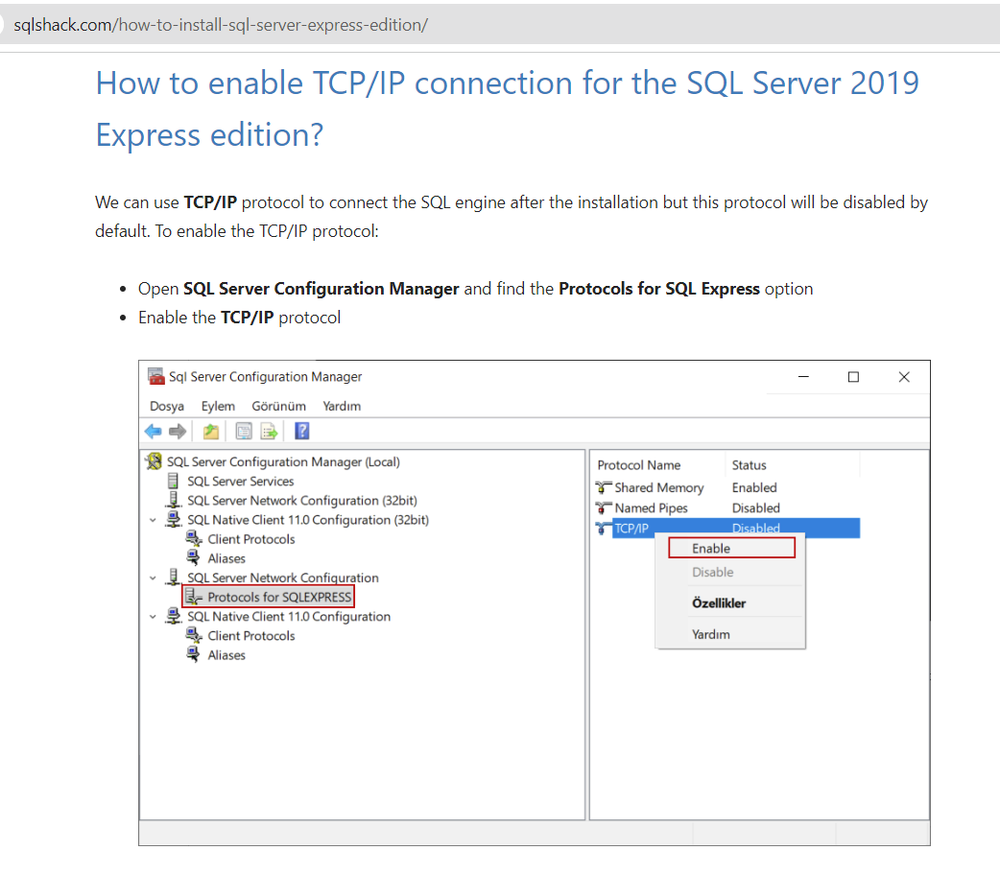
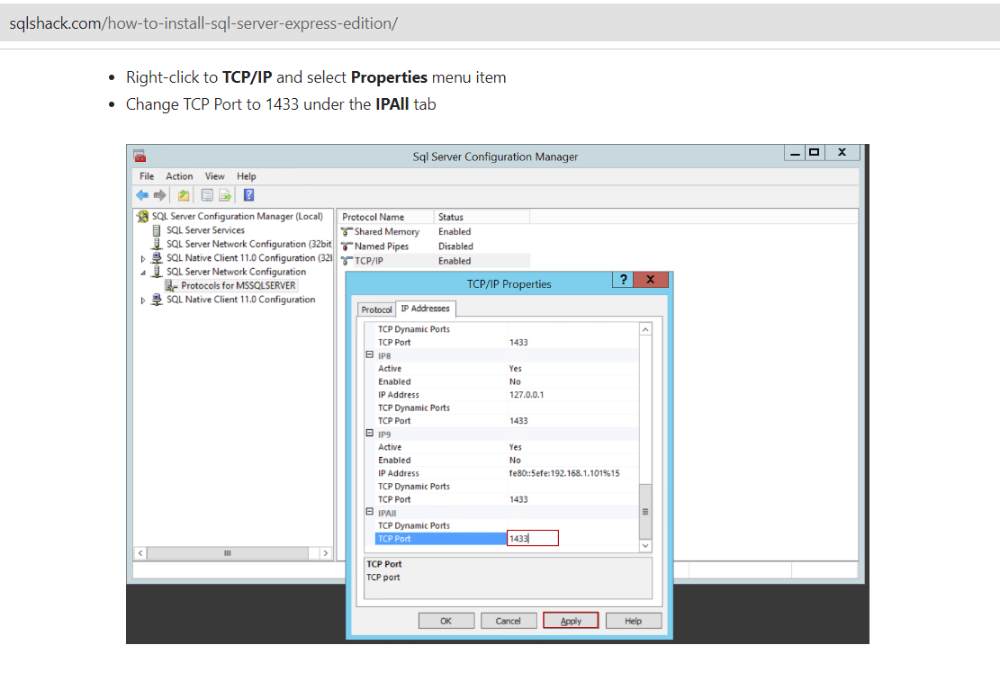
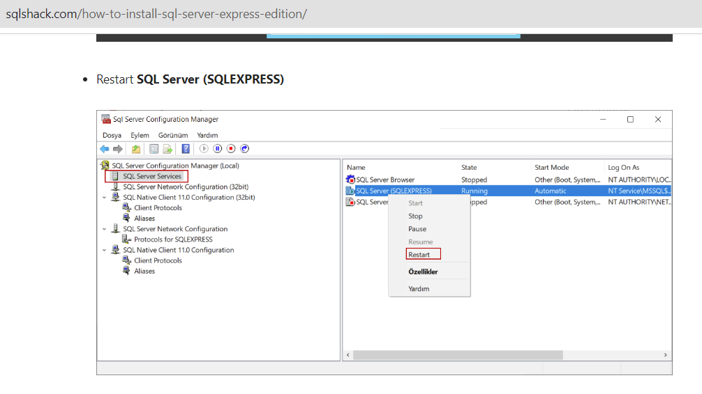
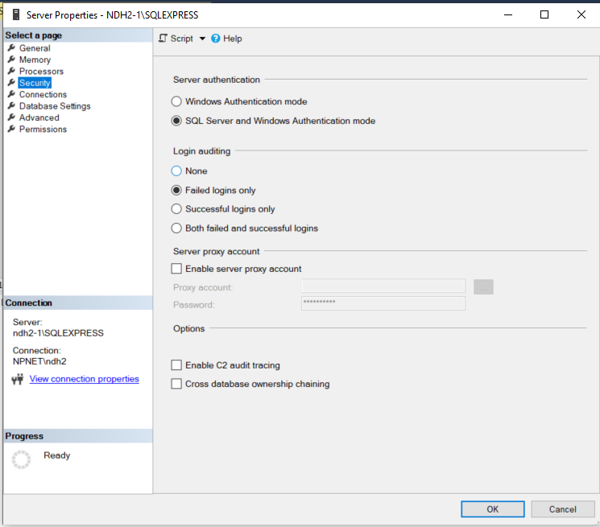
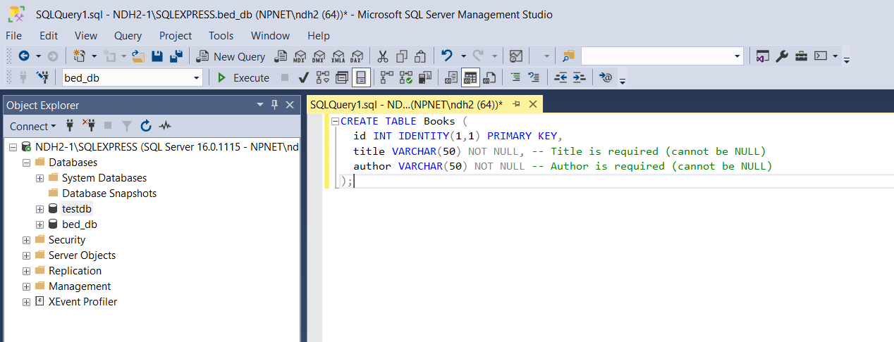
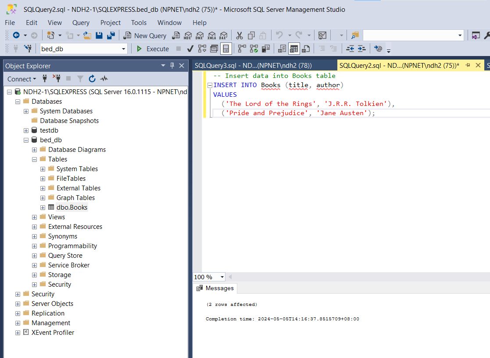
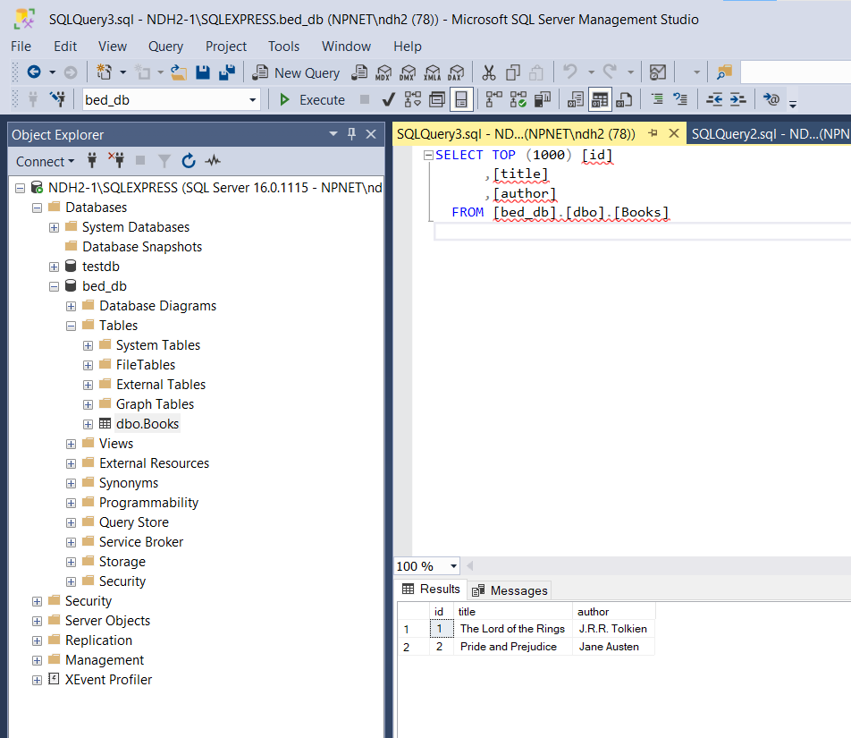
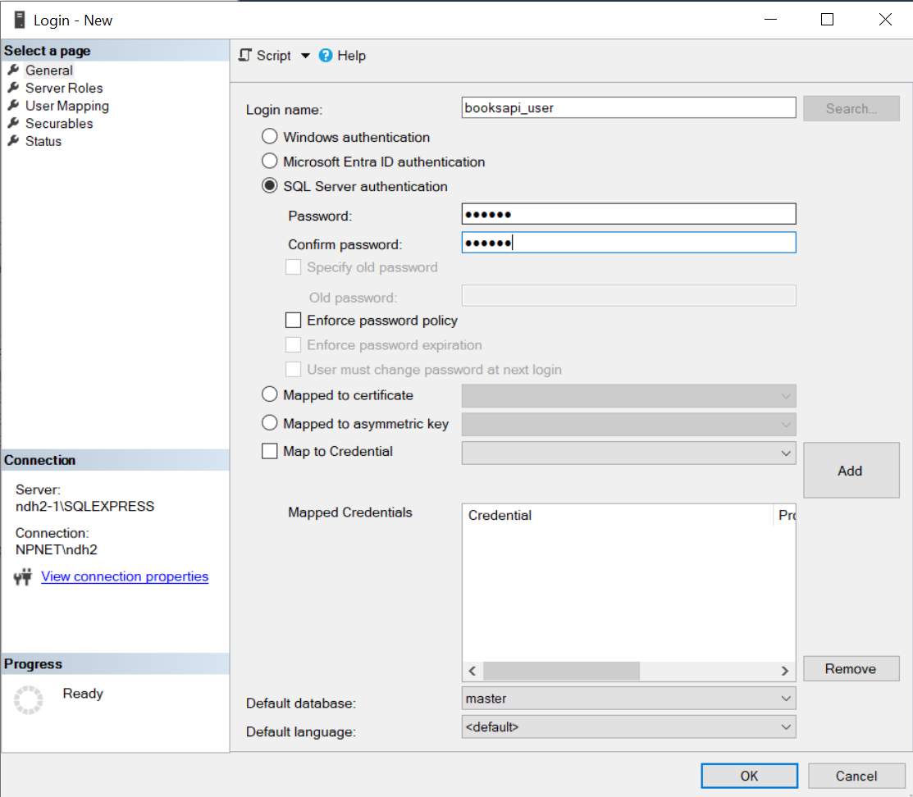
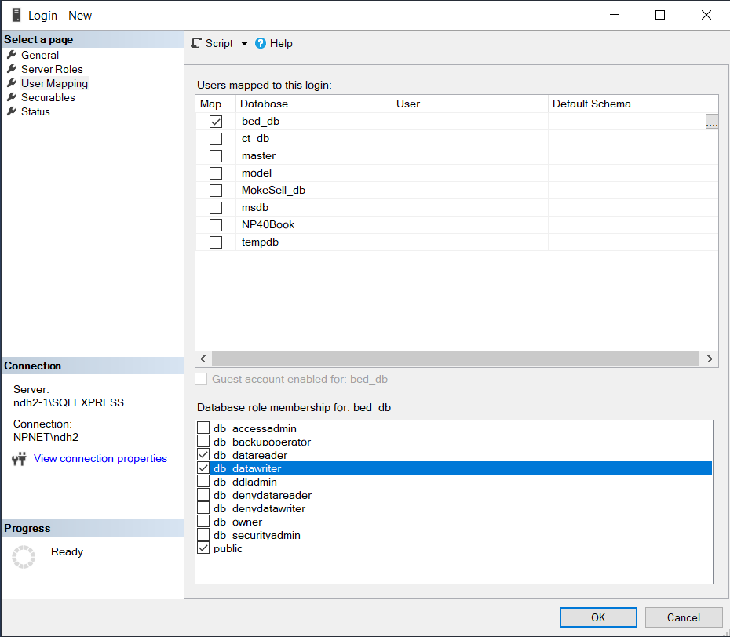

# Part A: Lab Activity

## Tasks:

- **Database Setup:**

  - Make sure you have Microsoft SQL Server Express installed on your local development machine.
  - Create a database `ssd_db` for storing book information.
  - Create the necessary database table for books (e.g., `id`, `title`, `author`).
  - Configure a dedicated SQL Server login user with appropriate permissions for your Node.js application.

- **Node.js and mssql Integration:**

  - Install the `mssql` package in your Node.js project to interact with the SQL Server database.
  - Establish a connection to the SQL Server database using the `mssql` package and your configured connection details.
  - Implement functions to perform CRUD operations on book data:
    - **Create:** Create a new book entry in the database.
    - **Read:** Retrieve existing book information by ID or retrieve all books.

- **Testing:**
  - Continue to use Postman for testing to ensure the functionality of your CRUD operations and API endpoints.

---

## Instructions:

### Step 1: Microsoft SQL Server Express Configuration

This step focuses on configuring Microsoft SQL Server Express to enable communication with your Node.js application:

**1.1 Enable TCP/IP Protocol:**

Here's how to enable the TCP/IP protocol for remote connections to your SQL Server instance:

**Using SQL Server Configuration Manager:**

- Open **SQL Server Configuration Manager**. You can find it in your Windows Start menu or by searching for it.
  - If you cannot find it, type `SQLServerManager16.msc` (for SQL Server 2022) in the Start Page to open **SQL Server Configuration Manager**.
- In the left pane, expand **SQL Server Network Configuration** and then your server instance name (usually "SQLEXPRESS").
- In the right pane, right-click on **Protocols for SQLEXPRESS** and select **Properties**.
- Under the **Protocol** tab, locate the **TCP/IP** entry.
- Ensure the **Enabled** checkbox is ticked.
- Under the **IP Addresses** tab, you'll see the **TCP Port**. This is the port on which your SQL Server listens for connections. The default port is usually 1433. You can leave it as the default or choose another available port.
- Click **OK** to save the changes.
- Restart your SQL Server service after making changes to the configuration.

**1.1.1 Enable TCP/IP protocol for SQL Server**



**1.1.2 Change TCP port to 1433 under IPAll tab**



**1.1.3 Restart SQL Server**



**1.2 Set Authentication Mode to Mixed Mode:**

Here's how to configure SQL Server Express to use mixed mode authentication:

**Using SQL Server Management Studio (SSMS):**

- Open **SQL Server Management Studio (SSMS)**. You can find it in your Windows Start menu or by searching for it.
- Connect to your SQL Server instance using Windows Authentication.
- In the Object Explorer window, right-click on your server instance name (usually "SQLEXPRESS") and select **Properties**.
- Go to the **Security** page.
- Under **Server authentication**, select **SQL Server and Windows Authentication mode**. This allows login using both Windows credentials and dedicated SQL Server logins.
- Click **OK** to save the changes.
- Restart your SQL Server service after making changes to the configuration.



**Important Notes:**

- Restart your SQL Server service after making changes to the configuration.
- Remember to replace "SQLEXPRESS" with your actual server instance name if it differs.

By following these steps, you've successfully configured your Microsoft SQL Server Express instance to enable remote connections via TCP/IP and support mixed mode authentication. This allows your Node.js application to connect and interact with the database in the next steps of the practical.

---

### Step 2: Creating Database and Populating Data

This step guides you through creating a database named `ssd_db` and populating it with a `Books` table containing sample data in Microsoft SQL Server Express:

**1. Connect to SQL Server Management Studio (SSMS):**

- Open **SQL Server Management Studio (SSMS)**. You can find it in your Windows Start menu or by searching for it.
- Connect to your SQL Server instance using appropriate credentials (e.g., the "sa" account or windows authentication).

**2. Create the Database:**

- In the **Object Explorer** window, right-click on **Databases** and select **New Database**.
- In the **New Database** window, enter **ssd_db** as the database name.
- Click **OK** to create the database.


**3. Execute the Scripts:**

- In the **Query** window, paste the following script:

```sql
CREATE TABLE Books (
  id INT IDENTITY(1,1) PRIMARY KEY,
  title VARCHAR(50) NOT NULL UNIQUE, -- Title is required and unique (cannot be NULL)
  author VARCHAR(50) NOT NULL -- Author is required (cannot be NULL)
);

-- Insert data into Books table
INSERT INTO Books (title, author)
VALUES
  ('The Lord of the Rings', 'J.R.R. Tolkien'),
  ('Pride and Prejudice', 'Jane Austen');
```

- Click the **Execute** button (or press F5) to run the script.

**3.1 Create table**



**3.2 Insert data**



**3.3 Verify data added**



**Explanation:**

- The first part of the script creates a table named "Books" with three columns:

  - `id`: An integer column with IDENTITY property set to automatically increment for each new record (primary key).
  - `title`: A varchar column with a maximum length of 50 characters, marked as NOT NULL and UNIQUE (required).
  - `author`: A varchar column with a maximum length of 50 characters, marked as NOT NULL (required).

- The second part of the script inserts two sample records into the "Books" table with titles and authors.

**Success:**

Upon successful execution, you should see a message indicating that the table was created and the data was inserted. You can verify this by right-clicking on the "ssd_db" database in the Object Explorer and selecting **Refresh**. Then, expand the database and navigate to **Tables**. You should see the "Books" table with the inserted data.

This step provides a foundation for the next steps in the practical, where you'll connect to the database from your Node.js application and perform CRUD operations on the "Books" table.

**4. Create a Dedicated Login User:**

Create a dedicated SQL Server login user specifically for your Node.js application. Here's how:

- In SSMS, navigate to **Security** > **Logins**.
- Right-click on **Logins** and select **New Login**.



- In the **Login name** field, enter a descriptive name for your application user (e.g., "booksapi_user").
- Select **SQL Server authentication**.

  - Set the password for the user.
  - Under the password fields, deselect the checkbox labeled "Enforce password policy". (You might also want to deselect "Enforce password expiration" for application logins to prevent connectivity issues when the password expires, but be aware of the security implications of doing so).

- Under **User Mapping**, map the user to `ssd_db` with the `db_datareader` and `db_datawriter` database role membership. the necessary permissions to access and modify the database. You can adjust these permissions based on your specific needs.



- Click **OK** to create the login user.

You have now successfully created a dedicated SQL Server login user that is ready to be used in your Node.js application's database configuration for the next steps.

---

### Step 3: Project Setup and Dependencies

This step guides you through setting up the project structure, initializing the project, and installing necessary dependencies for your Node.js application:

**1. Create Project Folder:**

- Open a terminal or command prompt window.
- Navigate to your BED Practicals Github Repo directory (e.g. BEDAPR2025_Practicals_P0X_SXXXXXXXX).
- Create a folder for this week's practical:

```bash
mkdir Practical03
cd Practical03
```

- Inside the `Practical03` folder, create another folder for your Books API code with database integration:

```bash
mkdir books-api-db
cd books-api-db
```

**2. Initialize npm Project:**

- Initialize a new npm project in the current directory:

```bash
npm init -y
```

The `-y` flag tells npm to accept the default options for project initialization.

**3. Create Main Entry Point:**

- Create a file named `app.js` to serve as the main entry point for your Node.js application.

**4. Install Dependencies:**

- Use npm to install the required packages for your API:

```bash
npm install express mssql
```

Here's a breakdown of the installed packages:

- **express:** A popular Node.js framework for building web applications and APIs.
- **mssql:** The core package for connecting to and interacting with Microsoft SQL Server databases from Node.js.
  **More about the `mssql` package**

### The mssql Package for Node.js and SQL Server Integration

The `mssql` package is a popular and well-maintained Node.js library that facilitates communication between your Node.js application and Microsoft SQL Server databases. Here's a breakdown of its key aspects:

**Functionality:**

- Provides an API for connecting to SQL Server instances using various authentication methods (e.g., SQL Server logins, Windows Authentication).
- Enables execution of SQL queries (SELECT, INSERT, UPDATE, DELETE) against your SQL Server database.
- Supports parameterized queries to prevent SQL injection vulnerabilities.
- Offers functionalities for handling transactions, stored procedures, and result sets.
- Provides connection pooling to manage database connections efficiently.

**Benefits:**

- Simplifies interaction with SQL Server from your Node.js application.
- Promotes secure database access through parameterized queries and authentication options.
- Offers a robust API for various database operations.
- Manages connections efficiently with connection pooling.

**Official Package:**

You can find the official `mssql` package on the npm registry: [https://www.npmjs.com/package/mssql](https://www.npmjs.com/package/mssql)

**5. Project Structure:**

Your project directory should now look something like this:

```
Practical03/
  books-api-db/
    package.json  # npm project configuration file
    app.js         # Main entry point for your Node.js application
```

This step establishes the foundation for building the Books API with SQL Server integration in the following steps.

---

### Step 4: Database Configuration and Connection Management

This step focuses on creating a configuration file for your database credentials and setting up connection logic within your Node.js application:

**1. Create dbConfig.js:**

In the root directory of your project (`books-api-db`), create a file named `dbConfig.js` with the following content:

```javascript
module.exports = {
  user: "username", // Replace with your SQL Server login username
  password: "password", // Replace with your SQL Server login password
  server: "localhost",
  database: "ssd_db",
  trustServerCertificate: true,
  options: {
    port: 1433, // Default SQL Server port
    connectionTimeout: 60000, // Connection timeout in milliseconds
  },
};
```

**Explanation:**

- This file defines an object containing your database connection details.
- Replace the placeholder values (`"username"`, etc.) with your actual SQL Server login credentials, server name, and database name.
- The `trustServerCertificate` option is set to `true` for development purposes. In production environments, consider using a more secure approach for certificate validation.
- The `options` object specifies the port (default for SQL Server) and a connection timeout value.

**2. Import and Connect in app.js:**

Import the `dbConfig` object in your `app.js` file and use it to establish the database connection during server startup:

```javascript
const express = require("express");
const sql = require("mssql"); // Assuming you've installed mssql
const dbConfig = require("./dbConfig");

const app = express();
const port = process.env.PORT || 3000; // Use environment variable or default port

app.use(express.json()); // middleware inbuilt in express to recognize the incoming Request Object as a JSON Object.
app.use(express.urlencoded()); // middleware inbuilt in express to recognize the incoming Request Object as strings or arrays

app.listen(port, async () => {
  try {
    // Connect to the database
    await sql.connect(dbConfig);
    console.log("Database connection established successfully");
  } catch (err) {
    console.error("Database connection error:", err);
    // Terminate the application with an error code (optional)
    process.exit(1); // Exit with code 1 indicating an error
  }

  console.log(`Server listening on port ${port}`);
});

// Close the connection pool on SIGINT signal
process.on("SIGINT", async () => {
  console.log("Server is gracefully shutting down");
  // Perform cleanup tasks (e.g., close database connections)
  await sql.close();
  console.log("Database connection closed");
  process.exit(0); // Exit with code 0 indicating successful shutdown
});
```

**Explanation:**

- We import `dbConfig` to access the database credentials.
- Inside the `app.listen` callback, we use `sql.connect(dbConfig)` to establish a connection to the database using the configuration details.
- The code attempts to connect asynchronously. If successful, it logs a confirmation message.
- An error handler is included to catch any connection errors and gracefully terminate the application with an appropriate exit code.

**3. Graceful Shutdown:**

The code utilizes the `SIGINT` signal handler to manage graceful shutdown. This signal is typically sent when you terminate the application using `Ctrl+C`.

- Upon receiving the signal, the code logs a message indicating shutdown.
- It then calls `sql.close()` to close the connection pool, releasing database resources.
- Finally, it exits the process with code 0, signifying a clean shutdown.

**Important Considerations:**

- Remember to replace the placeholder values in `dbConfig.js` with your actual credentials.
- For production environments, consider using environment variables to store sensitive information like passwords.
- You can further enhance the `dbConfig` object to include connection pooling options provided by the `mssql` package.

By implementing these steps, you've established a mechanism for configuring your database connection and managing its lifecycle within your Node.js application. This ensures a smooth connection process and proper resource cleanup during shutdown.

**4. Project Structure:**

Your project directory should now look something like this:

```
Practical03/
  books-api-db/
    package.json  # npm project configuration file
    app.js         # Main entry point for your Node.js application
    dbConfig.js   # configuration file for your database credentials
```

**5. Running the Application (node app.js):**

- In your terminal window, navigate to the root directory of your project (`books-api-db`).
- Run the following command to start your Node.js application:

```bash
node app.js
```

- If the database connection is successful, you should see the following messages in your terminal:

```
Database connection established successfully
Server listening on port 3000 (or your specified port)
```

**6. Verifying Graceful Shutdown (Ctrl+C):**

- Once you see the server listening message, press `Ctrl+C` on your keyboard to terminate the Node.js application.

- If the graceful shutdown logic works correctly, you should observe the following messages in your terminal:

```
Server is gracefully shutting down
Database connection closed
```

**Troubleshooting Tips:**

- **Connection Errors:**
  - Ensure your SQL Server instance is running and accessible from your development machine.
  - Verify that the provided database credentials (username, password) are correct and have appropriate permissions.
  - Double-check the server name and database name in your `dbConfig.js` file.
- **Firewall:**
  - Make sure your firewall allows connections to the SQL Server port (default 1433) if necessary.

If you encounter any errors during connection or shutdown, refer to the console output for clues.

By following these steps and addressing any potential issues, the learners can confirm a successful database connection and graceful shutdown functionality in their Node.js application.

---

### Step 5: Implementing GET Routes

In this step, you will add the GET routes for retrieving all books (`/books`) and retrieving a book by its ID (`/books/:id`). The full database interaction logic will be embedded directly within these route handlers.

Add the following route definitions below the database configuration object in your `app.js`.

```javascript
// --- GET Routes  ---

// GET all books
app.get("/books", async (req, res) => {
  let connection; // Declare connection outside try for finally block
  try {
    connection = await sql.connect(dbConfig); // Get the database connection
    const sqlQuery = `SELECT id, title, author FROM Books`; // Select specific columns
    const request = connection.request();
    const result = await request.query(sqlQuery);
    res.json(result.recordset); // Send the result as JSON
  } catch (error) {
    console.error("Error in GET /books:", error);
    res.status(500).send("Error retrieving books"); // Send a 500 error on failure
  } finally {
    if (connection) {
      try {
        await connection.close(); // Close the database connection
      } catch (closeError) {
        console.error("Error closing database connection:", closeError);
      }
    }
  }
});

// GET book by ID
app.get("/books/:id", async (req, res) => {
  const bookId = parseInt(req.params.id);
  if (isNaN(bookId)) {
    return res.status(400).send("Invalid book ID");
  }

  let connection;
  try {
    connection = await sql.connect(dbConfig); // Get the database connection
    const sqlQuery = `SELECT id, title, author FROM Books WHERE id = @id`;
    const request = connection.request();
    request.input("id", bookId); // Bind the id parameter
    const result = await request.query(sqlQuery);

    if (!result.recordset[0]) {
      return res.status(404).send("Book not found");
    }
    res.json(result.recordset[0]); // Send the book data as JSON
  } catch (error) {
    console.error(`Error in GET /books/${bookId}:`, error);
    res.status(500).send("Error retrieving book");
  } finally {
    if (connection) {
      try {
        await connection.close(); // Close the database connection
      } catch (closeError) {
        console.error("Error closing database connection:", closeError);
      }
    }
  }
});
```

**Explanation for Step 5:**

This step defines the API endpoints for retrieving book data.

- `GET /books`: This route handles requests to get a list of all books. Inside the handler, it directly connects to the database pool (`sql.connect(dbConfig)`), executes a `SELECT * FROM Books` SQL query, retrieves the results (`result.recordset`), and sends them back as a JSON array using `res.json()`.
- `GET /books/:id`: This route handles requests to get a single book by its ID. It extracts the ID from the URL parameters (`req.params.id`), converts it to an integer (`parseInt`), and performs a basic check (`isNaN`) for validity. It then directly connects to the database pool, executes a parameterized `SELECT * FROM Books WHERE id = @id` query using `request.input("id", bookId)` to safely bind the ID parameter. If a book is found (`result.recordset[0]`), it's sent as a JSON object; otherwise, a `404 Not Found` response is sent.

For both GET handlers, a `try...catch...finally` block is used. The `try` block contains the core logic. The `catch` block logs any errors and sends a `500 Internal Server Error` response. The `finally` block is crucial for ensuring that the database connection is closed using `connection.close()` after the request is processed, regardless of whether it succeeded or failed.

---

### Step 6: Implementing POST Route

In this step, you will add the POST route for creating a new book (`/books`). The full database interaction logic for creating a book will be embedded directly within this route handler.

Add the following route definition below the GET routes you added in Step 5.

```javascript
// --- POST Route  ---

// POST create new book
app.post("/books", async (req, res) => {
  const newBookData = req.body; // Get new book data from request body

  // **WARNING:** No validation is performed here. Invalid data may cause database errors. We will implement the necessary validation in future practicals.

  let connection;
  try {
    connection = await sql.connect(dbConfig); // Get the database connection
    const sqlQuery = `INSERT INTO Books (title, author) VALUES (@title, @author); SELECT SCOPE_IDENTITY() AS id;`;
    const request = connection.request();
    // Bind parameters from the request body
    request.input("title", newBookData.title);
    request.input("author", newBookData.author);
    const result = await request.query(sqlQuery);

    // Attempt to fetch the newly created book to return it
    const newBookId = result.recordset[0].id;

    // Directly fetch the new book here instead of calling a function
    // Re-using the same connection before closing it in finally
    const getNewBookQuery = `SELECT id, title, author FROM Books WHERE id = @id`;
    const getNewBookRequest = connection.request();
    getNewBookRequest.input("id", newBookId);
    const newBookResult = await getNewBookRequest.query(getNewBookQuery);

    res.status(201).json(newBookResult.recordset[0]); // Send 201 Created status and the new book data
  } catch (error) {
    console.error("Error in POST /books:", error);
    // Database errors due to invalid data (e.g., missing required fields) will likely be caught here
    res.status(500).send("Error creating book");
  } finally {
    if (connection) {
      try {
        await connection.close(); // Close the database connection
      } catch (closeError) {
        console.error("Error closing database connection:", closeError);
      }
    }
  }
});
```

**Explanation for Step 6:**

This step defines the API endpoint for creating a new book.

- `POST /books`: This route handles requests to create a book. It accesses the request body (`req.body`) which contains the new book's data (title and author, assuming the client sent JSON or URL-encoded data that Express parsed). It then directly connects to the database pool, executes a parameterized `INSERT` query to add the new book. The `SELECT SCOPE_IDENTITY() AS id;` part of the query is included to retrieve the ID that SQL Server automatically generated for the new row.
- After the insertion, the code immediately performs another query _using the same connection_ to fetch the complete details of the newly created book based on the retrieved ID. This is done so that the API can respond with the full representation of the resource that was just created, including its ID.
- If successful, a `201 Created` status code is sent along with the JSON representation of the new book.
- A `try...catch...finally` block is used for error handling and ensuring the database connection is released. **Importantly, because there is no validation**, if the request body is missing required fields (`title` or `author`) or contains data that violates database constraints (like the `UNIQUE` constraint on `title`), a database error will occur. This error is caught, and a generic `500 Internal Server Error` is returned.

---

### Step 7: Testing the API with Postman

Now that the code for Read (Get All and Get By ID) and Create operations is in place within `app.js`, you can run your application and test its functionalities using Postman.

1.  **Ensure your Node.js application is running:**

    - Open your terminal or command prompt.
    - Navigate to your project folder (`Practical03`).
    - Run the application:

      ```bash
      node app.js
      ```

    - You should see the messages indicating the database connection pool is created and the server is listening on the specified port (default 3000).

2.  **Open Postman:** Launch the Postman application.

3.  **Test GET All Books:**

    - Method: `GET`
    - URL: `http://localhost:3000/books`
    - Send the request. You should receive a JSON array of books currently in your database.

4.  **Test POST Create Book:**

    - Method: `POST`
    - URL: `http://localhost:3000/books`
    - Go to the "Body" tab, select "raw", and choose "JSON" from the dropdown.
    - Enter JSON data for a new book (e.g., `{ "title": "New Book", "author": "A.N. Author" }`).
    - Go to the "Headers" tab and ensure `Content-Type` is set to `application/json`.
    - Send the request. You should receive a `201 Created` status and the JSON data of the newly created book, including its assigned ID.
    - **Note:** Try sending invalid data (e.g., missing "title" or "author") and observe the `500 Internal Server Error` response from the server, as validation is not implemented.

5.  **Test GET Book by ID:**

    - Method: `GET`
    - URL: `http://localhost:3000/books/<ID>` (Replace `<ID>` with the ID of a book you just created or one already in your database, e.g., `http://localhost:3000/books/1`)
    - Send the request. You should receive a JSON object for the requested book. If the ID doesn't exist, you should receive a `404 Not Found` response.
    - **Note:** Try sending a non-numeric ID (e.g., `http://localhost:3000/books/abc`) and observe the `400 Bad Request` response from the basic ID validation in the route parameter parsing.

6.  **Attempt PUT or DELETE:**

    - Try making a `PUT` request to `http://localhost:3000/books/<ID>`.
    - Try making a `DELETE` request to `http://localhost:3000/books/<ID>`.
    - In both cases, you should receive a `404 Not Found` response, confirming that these routes are not defined in this version of the API.

7.  **Graceful Shutdown:**
    - In your terminal where `node app.js` is running, press `Ctrl+C`.
    - You should see the messages "Server is gracefully shutting down" and "Database connection pool closed".

By successfully completing these tests, you confirm that your Books API is functioning correctly for Read and Create operations and interacting with the SQL Server database as intended.

---

### ⏰ Step 8: Reflection & Q&A

1. **Create a new text file:**

   - Create a new file and save it with the name `Reflection_QA_PartA.txt`.

2. **Reflection:**

   - Write a **brief reflection** (at least 2-3 sentences) on the concepts you learned during Part A: Lab Activity of the practical. For example:
     - Look at the code in the final app.js file (where all logic is in routes and no validation). How easy or difficult is it to read and understand what's happening in each route handler compared to when the database logic was in separate functions?
     - If you found a bug in how books are created in the database, which version of app.js would make it easiest to isolate and fix that bug?
     - Did you face any challenges while implementing this practical?

3. **Save the file** along with your code.

---

## Summary of Learning points

### Good Points (Learned Techniques / Positive Aspects):

- **Connecting to MSSQL:** You learned how to use the `mssql` Node.js package to establish a connection pool to a Microsoft SQL Server database.
- **Storing Configuration:** You used a `dbConfig` object directly within `app.js` to store your database connection details (server, database, user, password, etc.). (Note: In a real application, environment variables are strongly recommended for security).
- **Performing Basic CRUD:** You gained hands-on experience writing the necessary SQL queries (`SELECT`, `INSERT`) and using the `mssql` package's methods (`connection.request()`, `request.input()`, `request.query()`) to perform basic Read (Get All, Get By ID) and Create operations directly from your Node.js application code.
- **Basic Error Handling:** Error handling is present within each handler's `try...catch...finally` block, designed to catch potential database errors and ensure connection release.
- **Using Built-in Express Parsers:** You used `express.json()` and `express.urlencoded()` demonstrating Express's built-in capabilities.

### Not So Good Points (Drawbacks):

- **Code Gets Crowded:** Putting _all_ the code (dealing with web requests, talking to the database, managing connections, handling errors) inside each single route handler means a lot is happening in one place.
  - This makes it **Hard to Reuse Code**: If you need to do the same database task somewhere else (not just in a route), you have to copy and paste the code because it's stuck inside the route handler.
  - This makes Routes **Very Long and Messy**: The code for each route handler becomes very long because it's doing so many different jobs instead of focusing just on handling the request. This makes it hard to read and understand quickly.
  - Handling Things Like **Database Connections Becomes Tricky**: Making sure the database connection is opened and closed correctly _every single time_ inside each busy route handler requires careful use of `try...catch...finally`, which adds complexity.
  - It's **Difficult to Test Parts Separately**: You can't easily test _just_ the database code without also running the whole route handler that it's embedded in.
- **No Checking User Input (No Validation):** This version doesn't check if the data the user sends is correct or complete before trying to use it.
  - This creates **Security and Reliability Problems**: If someone sends bad or unexpected data, it goes straight to the database code. This can cause the database operation to fail (leading to confusing 500 errors) or potentially create security risks.

**Highlighting Key Points:**

- Using a database package like `mssql` and managing database connections/pools are fundamental for Node.js applications interacting with SQL Server.
- Properly storing database configuration (though environment variables are preferred in production) and managing database connections are crucial steps.
- While it's technically possible to put all API logic directly into route handlers (as done in the "Not So Good" points above) severely harms code readability, reusability, maintainability, and testability.
- Implementing input validation is crucial for creating robust and secure APIs, providing clear feedback to clients.
- Encapsulating database logic in separate functions and files using `MVC` is highly recommended for cleaner, more manageable code.
- We will be learning and implementing `MVC` in future practicals.

---

## End of Part A: Lab Activity
