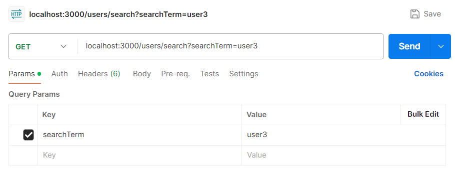

## Practical 06: Building User Functionalities and Relationships

### Lab Activity

This practical focuses on building user functionalities into your existing books API application. You will continue to use the `mssql` package to interact with your MSSQL database and establish relationships between users and books.

### Task 1: Project Setup and Directory Structure

1.  Navigate to your `books-api-mvc-db` project folder from Practical 04 and Practical 05. This is where you will continue working.

### Task 2: User Database Table Setup

1.  **Create the User Database Table:**
    You will create a new table in your MSSQL database to store user information. This table will typically include fields like username and email.

    - **Generate the SQL Script:**
      Here's the SQL script defining the User table structure:

      ```sql
      CREATE TABLE Users (
        id INT PRIMARY KEY IDENTITY,
        username VARCHAR(50) NOT NULL UNIQUE,
        email VARCHAR(100) NOT NULL UNIQUE
      );
      ```

      **Explanation:**

      - The script creates the `Users` table with the following columns:
        - `id`: An integer column with auto-incrementing primary key behavior for unique user identification.
        - `username`: A varchar column with a maximum length of 50 characters, marked as `NOT NULL` and `UNIQUE` for distinct usernames.
        - `email`: A varchar column with a maximum length of 100 characters, marked as `NOT NULL` and `UNIQUE` for distinct email addresses.

    - **Execute the Script in SSMS:**

      1.  Open Microsoft SQL Server Management Studio (SSMS).
      2.  Connect to your MSSQL database server using your login credentials.
      3.  In the Object Explorer window, navigate to the `ssd_db` database.
      4.  Right-click on the database name and select "New Query" to open a query window.
      5.  Paste the provided SQL script into the query window.
      6.  Click the "Execute" button (or press F5) to run the script.

      **Verification:**

      - A successful execution will display a message like "Command completed successfully" in the SSMS Messages window.
      - You can also verify the table creation by right-clicking on the database name, selecting "Refresh," and then expanding the "Tables" folder to see the newly created "Users" table listed.

### Task 3: Design and Implement User-Book Relationship

1.  **Designing the User-Book Relationship:**
    A many-to-many relationship arises when a single record in one table can be associated with multiple records in another table, and vice versa. This is often the case for users and books, as a user can have many books in their collection, and a single book can be owned or favored by multiple users.

    The primary approach to model many-to-many relationships in a relational database is by creating a separate table to represent the relationship between the two tables. This join table typically has two foreign keys, one referencing the primary key of the user table and another referencing the primary key of the book table.

    - **Join Table Design:**
      For this practical, you will create a table named `UserBooks` to represent the many-to-many relationship between users and books:

      ```sql
      CREATE TABLE UserBooks (
        id INT PRIMARY KEY IDENTITY,
        user_id INT FOREIGN KEY REFERENCES Users(id),
        book_id INT FOREIGN KEY REFERENCES Books(id)
      );
      ```

      **Explanation:**

      - The `UserBooks` table has three columns:
        - `id`: An integer column with auto-incrementing primary key behavior for unique identification of each relationship record.
        - `user_id`: An integer foreign key referencing the `id` column of the `Users` table, establishing a connection between a specific user and the books associated with them.
        - `book_id`: An integer foreign key referencing the `id` column of the `Books` table (assuming you have a separate Books table), establishing a connection between a specific book and the users who have it.

    - **Execute the Script in SSMS:**
      1.  Open Microsoft SQL Server Management Studio (SSMS).
      2.  Connect to your MSSQL database server using your login credentials.
      3.  In the Object Explorer window, navigate to the `ssd_db` database.
      4.  Right-click on the database name and select "New Query" to open a query window.
      5.  Paste the provided SQL script for the `UserBooks` table into the query window.
      6.  Click the "Execute" button (or press F5) to run the script.

### Task 4: Populate the Database

1.  **Populating the Database with Books, Users, and UserBooks (Using SSMS):**
    You will populate your MSSQL database with sample data for testing purposes.

    - **Populating Script:**
      Here's the SQL script to insert sample data:

      ```sql
      -- Insert sample books
      INSERT INTO Books (title, author)
      VALUES
        ('To Kill a Mockingbird', 'Harper Lee'),
        ('The Hitchhiker''s Guide to the Galaxy', 'Douglas Adams'),
        ('Dune', 'Frank Herbert'),
        ('The Great Gatsby', 'F. Scott Fitzgerald');

      -- Insert sample users
      INSERT INTO Users (username, email)
      VALUES
        ('user1', 'user1@example.com'),
        ('user2', 'user2@example.com'),
        ('user3', 'user3@example.com');

      -- Insert relationships between users and books
      INSERT INTO UserBooks (user_id, book_id)
      VALUES
        (1, 1),  -- User 1 has book 1
        (1, 2),  -- User 1 has book 2
        (1, 4),  -- User 1 has book 4
        (2, 3),  -- User 2 has book 3
        (2, 5),  -- User 2 has book 5
        (3, 1),  -- User 3 has book 1
        (3, 6);  -- User 3 has book 6
      ```

      **Explanation:**

      - More books (including titles and authors) are added to the `Books` table.
      - The number of users in the `Users` table is increased.
      - The `UserBooks` table now reflects the relationships between users and the books they have. Ensure the user IDs and book IDs correspond to existing entries in their respective tables.

    - **Running the Script in SSMS:**

      1.  Open SQL Server Management Studio (SSMS).
      2.  Connect to your MSSQL database server using your login credentials.
      3.  In the Object Explorer window, navigate to the `ssd_db` database.
      4.  Right-click on the database name and select "New Query" to open a query window.
      5.  Copy and paste the entire contents of the SQL script into the query window.
      6.  Click the "Execute" button (or press F5) to run the script.

      **Errors encountered and troubleshooting:**
      You might encounter the following error:

      ```
      The INSERT statement conflicted with the FOREIGN KEY constraint "FK__UserBooks__book___412EB0B6".
      The conflict occurred in database "ssd_db", table "dbo.Books", column 'id'.
      ```

      - Make sure that when you insert data into `UserBooks` table, the user ID and book ID do exist!

      **Verification:**

      - You can verify if the data has been inserted successfully by executing queries to view the contents of each table:

      ```sql
      SELECT * FROM Books;
      SELECT * FROM Users;
      SELECT * FROM UserBooks;
      ```

### Task 5: Implement User Management Functionalities (CRUD)

This task focuses on building the User controller and model with functions for CRUD operations, interacting directly with the MSSQL library. You will leverage your existing Books API implementation and structure for guidance.

**Project Structure:**

- You already have the `models` and `controllers` folders from Practical 04. You will build on top of these existing folders.

1.  **User Model (`models/userModel.js`):**

    - Create `userModel.js` file in the `models` folder.
    - Include methods for each CRUD operation using the MSSQL library:
      - **`createUser(user)`:**
        - Connect to the MSSQL database using your connection details.
        - Create a SQL `INSERT` statement to insert the user data (`user` object) into the `Users` table.
        - Execute the query using the MSSQL library and handle any errors.
        - Retrieve the newly created user's information (e.g., using `SELECT` statement after insertion) and return the user object.
        - Close the connection to the database.
      - **`getAllUsers()`:**
        - Connect to the MSSQL database.
        - Create a SQL `SELECT` statement to retrieve all user data from the `Users` table.
        - Execute the query using the MSSQL library and handle any errors.
        - Return an array of user objects constructed from the retrieved data.
        - Close the connection to the database.
      - **`getUserById(id)`:**
        - Connect to the MSSQL database.
        - Create a SQL `SELECT` statement to retrieve a specific user by ID from the `Users` table.
        - Execute the query using the MSSQL library and handle any errors.
        - Return the user object (or `null` if not found).
        - Close the connection to the database.
      - **`updateUser(id, updatedUser)`:**
        - Connect to the MSSQL database.
        - Create a SQL `UPDATE` statement to update the user information for the specified ID, using the provided `updatedUser` data.
        - Execute the query using the MSSQL library and handle any errors.
        - Return a success message or updated user information (optional).
        - Close the connection to the database.
      - **`deleteUser(id)`:**
        - Connect to the MSSQL database.
        - Create a SQL `DELETE` statement to delete the user with the specified ID from the `Users` table.
        - Execute the query using the MSSQL library and handle any errors.
        - Return a success message (or handle deletion failure).
        - Close the connection to the database.

2.  **User Controller (`controllers/userController.js`):**

    - Create `userController.js` file in the `controllers` folder.
    - Import the `User` model (`models/userModel.js`) at the beginning of the file.
    - Define functions for each CRUD operation, calling the corresponding methods from the `User` model:
      - **`createUser(req, res)`:**
        - Extract user data from the request body.
        - Call the `User.createUser` method to save the new user.
        - Upon successful creation, return a success response with the created user data.
        - Handle potential errors during user creation and return appropriate error responses.
      - **`getAllUsers(req, res)`:**
        - Call the `User.getAllUsers` method to retrieve all users.
        - Upon successful retrieval, return a response with the list of user objects.
        - Handle potential errors during user retrieval and return appropriate error responses.
      - **`getUserById(req, res)`:**
        - Extract the user ID from the request parameter.
        - Call the `User.getUserById` method to find the user.
        - If found, return a response with the user object.
        - If not found, return a not-found error response.
        - Handle potential errors during user retrieval and return appropriate error responses.
      - **`updateUser(req, res)`:**
        - Extract the user ID and updated data from the request.
        - Call the `User.updateUser` method to update the user information.
        - Upon successful update, return a success response.
        - Handle potential errors during user update and return appropriate error responses.
      - **`deleteUser(req, res)`:**
        - Extract the user ID from the request parameter.
        - Call the `User.deleteUser` method to delete the user.
        - Upon successful deletion, return a success response.
        - Handle potential errors during user deletion and return appropriate error responses.

3.  **Main Application (`app.js`):**

    - Go to the `app.js` file.
    - Import the `userController` from `controllers/userController.js`.
    - Define routes for user functionalities.
    - For each route, call the corresponding function from the `userController` instance, passing the request and response objects (similar structure to your Books API routes).

    **Example Routes (`app.js`):**

    ```javascript
    // existing code above
    const userController = require("./controllers/userController"); // Note: Changed to userController for consistency

    // ... existing code in between

    app.post("/users", userController.createUser); // Create user
    app.get("/users", userController.getAllUsers); // Get all users
    app.get("/users/:id", userController.getUserById); // Get user by ID
    app.put("/users/:id", userController.updateUser); // Update user
    app.delete("/users/:id", userController.deleteUser); // Delete user

    // ... existing code after
    ```

    **Additional Tips:**

    - Continue to use parameterized statements in your MSSQL queries to prevent SQL injection vulnerabilities.
    - Validate user input (e.g., username format, email format) before saving data to the database.

### Task 6: Implement User Search and Postman Testing

This task expands the user management functionalities to include searching for users based on username or email.

1.  **Implementation:**

    **User Model (`models/userModel.js`):**

    ```javascript
    const sql = require("mssql");
    const dbConfig = require("../dbConfig");

    // ... existing model functions ...

    async function searchUsers(searchTerm) {
      let connection; // Declare connection outside try for finally access
      try {
        connection = await sql.connect(dbConfig);

        // Use parameterized query to prevent SQL injection
        const query = `
        SELECT *
        FROM Users
        WHERE username LIKE '%' + @searchTerm + '%'
            OR email LIKE '%' + @searchTerm + '%'
        `;

        const request = connection.request();
        request.input("searchTerm", sql.NVarChar, searchTerm); // Explicitly define type
        const result = await request.query(query);
        return result.recordset;
      } catch (error) {
        console.error("Database error in searchUsers:", error); // More specific error logging
        throw error; // Re-throw the error for the controller to handle
      } finally {
        if (connection) {
          try {
            await connection.close();
          } catch (err) {
            console.error("Error closing connection after searchUsers:", err);
          }
        }
      }
    }

    module.exports = {
      // ... existing exports ...
      searchUsers,
    };
    ```

    **Explanation:**

    - The `searchUsers` method takes a `searchTerm` as input (username or email fragment).
    - It connects to the MSSQL database.
    - The SQL query uses `LIKE` with wildcards (`%`) to perform a case-insensitive search for the `searchTerm` in both username and email columns. **Crucially, it uses a parameterized query (`@searchTerm`) to prevent SQL injection.**
    - The query results are retrieved using `connection.request().query` and returned as the `recordset`.
    - Error handling is implemented using a `try...catch...finally` block.
    - The connection is closed even on errors using the `finally` block.

    **User Controller (`controllers/userController.js`):**

    ```javascript
    const User = require("../models/userModel");

    // ... existing controller functions ...

    async function searchUsers(req, res) {
      const searchTerm = req.query.searchTerm; // Extract search term from query params

      if (!searchTerm) {
        return res.status(400).json({ message: "Search term is required" });
      }

      try {
        const users = await User.searchUsers(searchTerm);
        res.json(users);
      } catch (error) {
        console.error("Controller error in searchUsers:", error);
        res.status(500).json({ message: "Error searching users" });
      }
    }

    module.exports = {
      // ... existing exports ...
      searchUsers,
    };
    ```

    **Explanation:**

    - The `searchUsers` controller function extracts the `searchTerm` from the request query parameters.
    - It includes a check for a missing `searchTerm` and sends a 400 Bad Request if it's not provided.
    - It calls the static `searchUsers` method in the `User` model.
    - Upon successful search, the retrieved users are sent as a JSON response.
    - Error handling sends a generic error message with a 500 status code.

    **Main Application (`app.js`):**

    ```javascript
    const userController = require("./controllers/userController"); // import the User Controller in app.js

    // ... existing routes ...

    app.get("/users/search", userController.searchUsers);
    ```

2.  **Testing with Postman:**

    - **Setting Up the Request:**

      - Open Postman and create a new `GET` request.
      - Enter the base URL of your backend API where the user search route is defined. For example, if your route is at `http://localhost:3000/users/search`, paste that URL into the address bar.

    - **Adding the Search Term:**

      - User search typically uses query parameters. In Postman, click on the "Params" tab next to the URL.
      - Click on "+ Key" to add a new query parameter.
      - In the **Key** field, enter `searchTerm`.
      - In the **Value** field, enter the search term you want to use. For example, you could enter "user" to search for users with "user" in their username or email.

        

    - **Sending the Request:**

      - Ensure the request method is set to `GET`.
      - Click the **Send** button to send the request to your backend API.

    - **Expected Behavior:**
      - Upon successful execution, your backend API should return a JSON response containing an array of user objects matching the search term.

### Task 7: Get Users with Books

This task focuses on retrieving a list of users along with their books, utilizing the `UserBooks` database table that represents the many-to-many relationships between `Users` and `Books`.

1.  **User Model Enhancements (`models/userModel.js`):**

    The `User` model introduces a new method `getUsersWithBooks` to fetch users with their book information.

    ```javascript
    const sql = require("mssql");
    const dbConfig = require("../dbConfig");

    // ... existing model functions ...

    async function getUsersWithBooks() {
      let connection;
      try {
        connection = await sql.connect(dbConfig);

        const query = `
        SELECT u.id AS user_id, u.username, u.email, b.id AS book_id, b.title, b.author
        FROM Users u
        LEFT JOIN UserBooks ub ON ub.user_id = u.id
        LEFT JOIN Books b ON ub.book_id = b.id
        ORDER BY u.username;
        `;

        const result = await connection.request().query(query);

        // Explanation of 'result' object and 'result.recordset':
        // The mssql package returns query results in a 'result' object.
        // 'result.recordset' is an array of JavaScript objects.
        // Each object in 'result.recordset' represents a row from the SQL query's output.
        // The keys of these objects correspond to the column aliases (e.g., 'user_id', 'username', 'book_id', 'title', 'author')
        // defined in the SQL SELECT statement.
        // For example, multiple rows from the SQL query like:
        // user_id | username | email             | book_id | title                         | author
        // --------|----------|-------------------|---------|-------------------------------|-----------------
        // 1       | user1    | user1@example.com | 1       | To Kill a Mockingbird       | Harper Lee
        // 1       | user1    | user1@example.com | 2       | The Hitchhiker's Guide to the Galaxy | Douglas Adams
        //
        // would be represented in 'result.recordset' as an array of objects:
        // [
        //   {
        //     user_id: 1,
        //     username: 'user1',
        //     email: 'user1@example.com',
        //     book_id: 1,
        //     title: 'To Kill a Mockingbird',
        //     author: 'Harper Lee'
        //   },
        //   {
        //     user_id: 1,
        //     username: 'user1',
        //     email: 'user1@example.com',
        //     book_id: 2,
        //     title: 'The Hitchhiker\'s Guide to the Galaxy',
        //     author: 'Douglas Adams'
        //   }
        // ]
        //
        // If a user has multiple books, there will be multiple rows for that user,
        // each with the same user information but different book information.
        // The subsequent JavaScript code then groups these rows by user.

        // Group users and their books
        const usersWithBooks = {};
        for (const row of result.recordset) {
          const userId = row.user_id;
          if (!usersWithBooks[userId]) {
            usersWithBooks[userId] = {
              id: userId,
              username: row.username,
              email: row.email,
              books: [],
            };
          }
          // Only add book if book_id is not null (for users with no books)
          if (row.book_id !== null) {
            usersWithBooks[userId].books.push({
              id: row.book_id,
              title: row.title,
              author: row.author,
            });
          }
        }

        return Object.values(usersWithBooks);
      } catch (error) {
        console.error("Database error in getUsersWithBooks:", error);
        throw error;
      } finally {
        if (connection) {
          try {
            await connection.close();
          } catch (err) {
            console.error(
              "Error closing connection after getUsersWithBooks:",
              err
            );
          }
        }
      }
    }

    module.exports = {
      // ... existing exports ...
      getUsersWithBooks,
    };
    ```

    **Explanation:**

    - The `getUsersWithBooks` method connects to the database.
    - It executes a SQL query with `LEFT JOIN`s to retrieve user information from `Users`, borrowed book IDs from `UserBooks`, and corresponding book details from `Books`.
    - It uses `ORDER BY u.username` to order users alphabetically.
    - The result set is processed to group users and their borrowed books. An object is created for each user, containing their details and an array of borrowed book objects.
    - Finally, an array of user objects with their borrowed books is returned.
    - Error handling is implemented using a `try...catch...finally` block.

2.  **User Controller Enhancements (`controllers/userController.js`):**

    The `userController.js` introduces a new function `getUsersWithBooks` to handle incoming requests for users with their books.

    ```javascript
    const User = require("../models/userModel");

    async function getUsersWithBooks(req, res) {
      try {
        const users = await User.getUsersWithBooks();
        res.json(users);
      } catch (error) {
        console.error("Controller error in getUsersWithBooks:", error);
        res.status(500).json({ message: "Error fetching users with books" });
      }
    }

    module.exports = {
      // ... other exports ...
      getUsersWithBooks,
    };
    ```

    **Explanation:**

    - The `getUsersWithBooks` controller function calls the `User.getUsersWithBooks` method from the User model.
    - Upon successful retrieval, it sends the user data as a JSON response.
    - Error handling is implemented to send a generic error message in case of issues.

3.  **Integration and Testing:**

    - Include the `getUsersWithBooks` function from `userController.js` in your `app.js` for the desired endpoint (e.g., `/users/with-books`).

    ```javascript
    // ... existing Users routes ...
    app.get("/users/with-books", userController.getUsersWithBooks);
    ```

    - Use Postman or a similar tool to send a `GET` request to this endpoint.
    - The response should be a JSON array containing user objects with their usernames, emails, and an array of borrowed book objects (including title and author).

### Summary

This lab activity guided you through implementing comprehensive user management functionalities and establishing relationships with the existing books API. Key takeaways include:

- **Database Schema Design:** Creating `Users` and `UserBooks` tables to store user information and manage many-to-many relationships between users and books.
- **CRUD Operations:** Implementing Create, Read, Update, and Delete operations for users in both the model and controller layers.
- **User Search Functionality:** Adding a search capability for users based on `username` or `email`, emphasizing the use of parameterized queries to prevent SQL injection.
- **Joined Data Retrieval:** Fetching users along with their associated books using SQL `LEFT JOIN` operations and processing the `mssql` package's `result.recordset` to structure the data appropriately.
- **MVC Architecture Reinforcement:** Applying the Model-View-Controller (MVC) pattern to separate concerns, leading to a more modular, maintainable, and scalable application.

By completing this practical, you have gained hands-on experience in building robust user management systems, managing complex database relationships, and reinforcing best practices for secure and efficient API development.

#### End of Lab Activity
